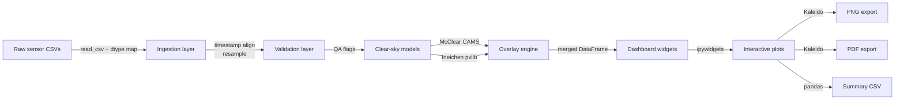
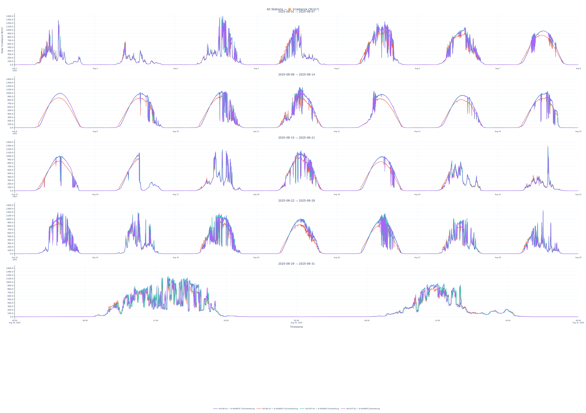
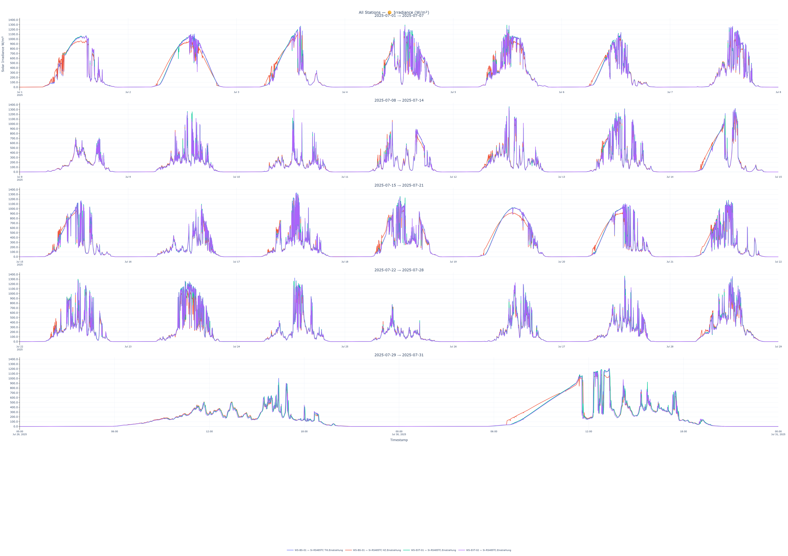

<div>


[](https://www.python.org/)
[](https://pvlib-python.readthedocs.io/)
[](https://plotly.com/python/)
[](https://jupyter.org/)
[](LICENSE)
[](https://github.com/psf/black)
[]()

</div>

---

## 📖 Overview

This repository documents a complete **data engineering and analytics pipeline** built around a multi-station weather monitoring network. It covers the full lifecycle of meteorological sensor data — from secure remote acquisition through cleaning, correction, merging, and into a fully interactive, presentation-ready visualization layer.

The system was developed to support **data quality assurance and irradiance benchmarking for renewable energy performance analysis**, with particular emphasis on cross-validating ground-based solar irradiance sensors against independent clear-sky reference models — a workflow directly relevant to PV yield assessment and BESS dispatch analytics.

Built with a strong focus on **engineering reliability**: robust parsing of heterogeneous European-format log files, defensive handling of missing/zero sensor readings, automated data-availability auditing, and print-grade (A3) export pipelines suitable for technical reporting.


---

## 📊 Visual Gallery (Dashboard screenshots)

> **Showing what's here:** the gallery below covers the primary dashboard views. Exports from the pipeline are shown in the [Exports showcase](#exports-showcase) section.

| McClear clear-sky overlay — 1-day view | Multi-sensor group comparison |
|:---:|:---:|
|  |  |
| *Measured GHI vs McClear satellite model and Ineichen physical model, with unified hover cursor* | *Multi-group checkbox selector — toggle sensor channels independently* |

| Weekly chunked view | Selected date-range overview |
|:---:|:---:|
|  |  |
| *Configurable weekly chunking for long time-series inspection* | *Selected date measurement span with data-quality shading* |

---

## 📑 Table of Contents

- [Key Features](#-key-features)
- [System Architecture](#-system-architecture)
- [Data Pipeline](#-data-pipeline)
- [Tech Stack](#-tech-stack)
- [Repository Structure](#-repository-structure)
- [Getting Started](#-getting-started)
- [Usage Walkthrough](#-usage-walkthrough)
- [Data Privacy & GDPR Compliance](#-data-privacy--gdpr-compliance)
- [Code Availability](#-code-availability)
- [Roadmap](#-roadmap)
- [Author](#-author)
- [License](#-license)


---

## Key features

**Data pipeline**
- Ingests multi-sensor weather station CSVs with automatic column detection and alignment
- Validates timestamps, fills gaps, and resamples to a configurable resolution (default 5-minute)
- Applies physical plausibility checks against McClear and Ineichen clear-sky envelopes
- Generates per-sensor QA summary tables with completeness and outlier statistics

**Interactive dashboard**
- Checkbox-driven sensor group selection — toggle individual channels without re-running cells
- Configurable weekly chunking for long time-series exploration
- Unified hover cursors across all subplots via Plotly's `hovermode="x unified"`
- Date-range picker widget for instant sub-period drill-down

**Export pipeline**
- One-click Kaleido-powered PNG export at 150 dpi (screen) and 300 dpi (print)
- A3-format PDF export with auto-scaled figure layout for direct printing
- Per-session summary CSV with key statistics exported alongside figures

**Privacy & compliance**
- All raw data and personally identifying metadata stay local — nothing is transmitted
- Sensor labels are configurable aliases, decoupled from station identifiers
- GDPR-compatible data-retention workflow: see [Data privacy](#data-privacy)

---

## System architecture



---

## Data pipeline stages

| Stage | Input | Output | Key library |
|---|---|---|---|
| 1. Ingestion | Raw sensor `.csv` | Typed `pd.DataFrame` | `pandas` |
| 2. Validation | Raw DataFrame | QA-flagged DataFrame | `pandas`, `numpy` |
| 3. Clear-sky modelling | Station lat/lon, timestamps | McClear & Ineichen series | `pvlib` |
| 4. Overlay assembly | Sensor + model series | Merged DataFrame | `pandas` |
| 5. Visualisation | Merged DataFrame | Plotly `Figure` objects | `plotly` |
| 6. Widget layer | Figures | Interactive controls | `ipywidgets` |
| 7. Export | Figures | PNG, PDF, CSV | `kaleido`, `reportlab` |

---

## Tech stack

| Component | Library | Version | Purpose |
|---|---|---|---|
| Data wrangling | `pandas` | ≥ 1.5 | Ingestion, resampling, QA |
| Numerical ops | `numpy` | ≥ 1.23 | Vectorised calculations |
| Solar modelling | `pvlib` | ≥ 0.10 | Clear-sky irradiance models |
| Visualisation | `plotly` | ≥ 5.11 | Interactive figures |
| Widget layer | `ipywidgets` | ≥ 8.0 | Dashboard controls |
| Static export | `kaleido` | ≥ 0.2 | PNG / PDF rendering |
| Notebook runtime | `jupyterlab` | ≥ 4.0 | Interactive environment |

---

## 📁 Repository Structure

```
weather-station-analytics/
├── notebooks/
│   ├── 01_ingest_and_merge.ipynb
│   ├── 02_timestamp_correction.ipynb
│   ├── 03_interactive_dashboard.ipynb
│   └── 04_clearsky_benchmarking.ipynb
├── exports/
│   ├── PNG/
│   ├── PDF/
│   └── Summary/
├── requirements.txt
└── README.md
```

---

## Exports showcase

> These are representative export samples. Your session exports land in `exports/PNG/`, `exports/PDF/`, and `exports/Summary/` automatically when you run notebook `04_export_pipeline.ipynb`.

### PNG exports (150 dpi / 300 dpi)

| Dashboard — 1-day irradiance (screen, 150 dpi) | A3 print layout (300 dpi) |
|:---:|:---:|
|  |  |
| *Exported via Kaleido at 1920 × 1080 px* | *A3 landscape, 300 dpi, ready for direct printing* |

### Summary CSV

Each export session produces a `summary_YYYYMMDD_HHMMSS.csv` in `exports/Summary/` with:

```
station_id, sensor_group, date_range_start, date_range_end,
completeness_pct, clearsky_model, rmse_wm2, mae_wm2,
peak_ghi_wm2, export_timestamp
```

---


## Getting started

### 1. Clone the repository

```bash
git clone https://github.com/AIMLDS7/Weather-Station-Data-Pipeline-Interactive-Analytics-Dashboard.git
cd Weather-Station-Data-Pipeline-Interactive-Analytics-Dashboard
```

### 2. Set up the environment

**Recommended — conda (handles pvlib dependencies cleanly):**

```bash
conda env create -f environment.yml
conda activate wx-pipeline
```

**Alternative — pip:**

```bash
python -m venv .venv
source .venv/bin/activate        # Windows: .venv\Scripts\activate
pip install -r requirements.txt
```

### 3. Enable the ipywidgets extension

```bash
jupyter labextension install @jupyter-widgets/jupyterlab-manager   # JupyterLab < 3
# JupyterLab 3+ includes widgets by default — no extra step needed
```

### 4. Launch

```bash
jupyter lab notebooks/03_dashboard.ipynb
```

---

## Usage walkthrough

**Step 1 — Configure your data path**

Open `notebooks/03_dashboard.ipynb` and update the config cell at the top:

```python
DATA_PATH   = "path/to/your/sensor_data.csv"
STATION_LAT = 48.2082    # Vienna, Austria — change to your station
STATION_LON = 16.3738
TIMEZONE    = "Europe/Vienna"
```

**Step 2 — Run all cells**

`Kernel → Restart & Run All`. The ingestion and clear-sky model stages run once; the widget dashboard renders at the bottom.

**Step 3 — Explore interactively**

- Use the **sensor group checkboxes** to toggle individual channels on/off
- Adjust the **weekly chunk slider** to step through longer time series
- Use the **date range picker** for sub-period drill-down
- Hover anywhere on the figure — unified cursor shows all series values

**Step 4 — Export**

Switch to `notebooks/04_export_pipeline.ipynb` and run. Outputs appear in `exports/`.

---

## Data privacy

This project was developed using real weather station measurements. To comply with data-sharing restrictions:

- **No raw data is included in this repository.** The `notebooks/` folder contains the analytical pipeline only; sensor data must be supplied by the user.
- **No network calls are made during analysis.** pvlib's clear-sky models run locally; McClear parameters are bundled offline after initial CAMS retrieval.
- **Station metadata** (coordinates, station IDs) are externalised to the config cell and not hard-coded.
- **Export filenames** use timestamps, not station identifiers, to avoid accidental PII in filenames.

For research or commercial use of weather station data, consult the data provider's terms and applicable GDPR obligations for your jurisdiction.

---

## Roadmap

- [ ] `v1.1` — Multi-station comparison view (overlay N stations on one figure)
- [ ] `v1.1` — Automatic outlier annotation on export (flag suspect data points)
- [ ] `v1.2` — BESS / energy storage event overlay support
- [ ] `v1.2` — TMY (Typical Meteorological Year) generation from multi-year data
- [ ] `v1.3` — Streamlit web app wrapper for non-Jupyter deployment
- [ ] `v2.0` — REST API endpoint for headless pipeline execution

---

## Contributing

This repository is a portfolio project. The notebooks are illustrative; the underlying production implementation is not included. If you have questions about the methodology or want to discuss solar irradiance analytics, open a [GitHub Discussion](https://github.com/AIMLDS7/Weather-Station-Data-Pipeline-Interactive-Analytics-Dashboard/discussions) or raise an [Issue](https://github.com/AIMLDS7/Weather-Station-Data-Pipeline-Interactive-Analytics-Dashboard/issues).

Pull requests that improve the documentation, fix bugs in the illustrative notebooks, or add new export formats are welcome.

---

## 📜 Code Availability

The full source code for this project is **not publicly released**.

It can be shared on request for:

- 🎓 Academic collaboration or research partnerships
- 💼 Commercial licensing discussions
- 🔍 Independent verification of methodology

Please reach out via **[GitHub](https://github.com/AIMLDS7)** or email.


## 👤 Author

**Darshitkumar Gohel**
M.Sc. Sustainable Energy Systems — FH Oberösterreich
Energy Systems Modelling · BESS Analytics · EPC Commercial Management

- GitHub: [@AIMLDS7](https://github.com/AIMLDS7)
- Portfolio: [aimlds7.github.io](https://aimlds7.github.io)

---

## 📄 License

This repository (documentation, structure, and visual assets) is shared for portfolio and demonstration purposes. The underlying implementation is proprietary — see [Code Availability](#-code-availability) for licensing and collaboration inquiries.


<div align="center">
  <sub>Built with pvlib · plotly · ipywidgets · kaleido · pandas</sub>
</div>

---

