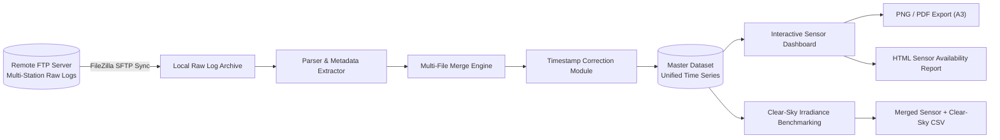
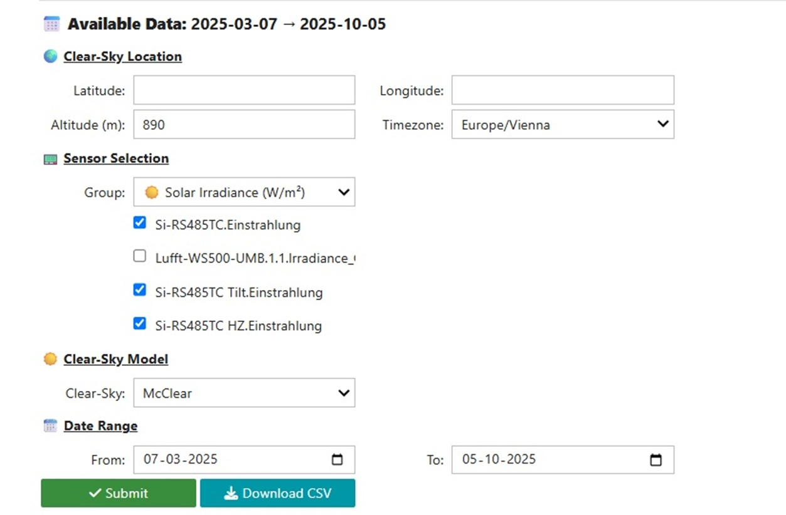
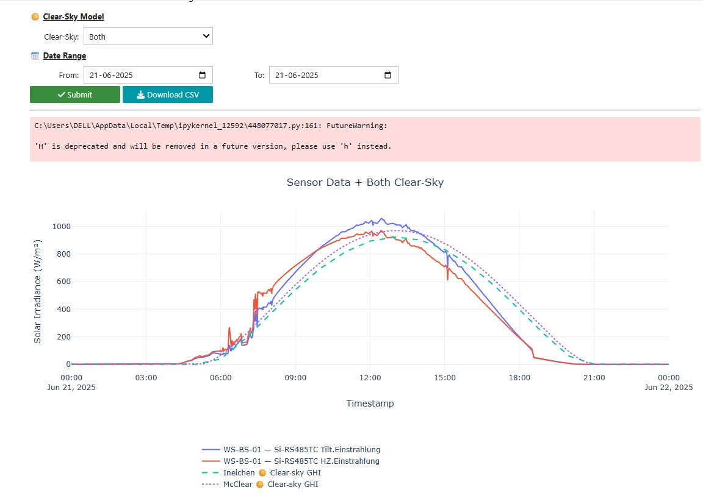
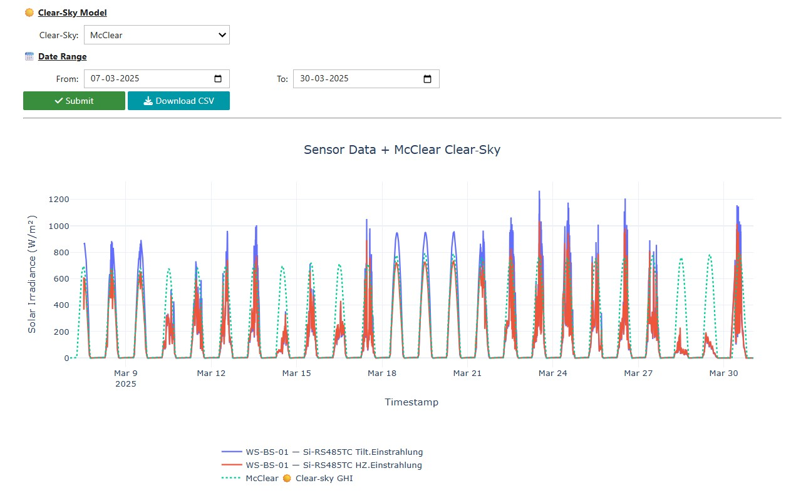
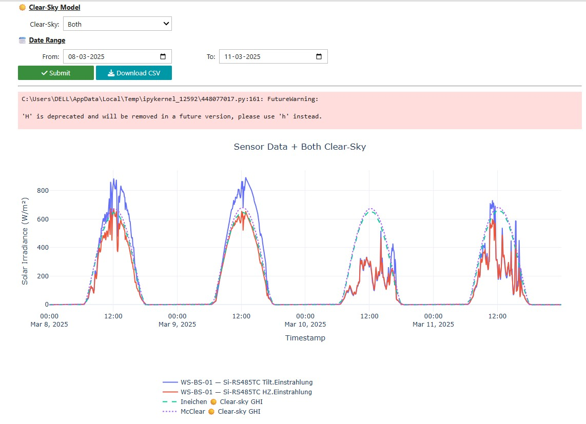

<div align="center">


**End-to-end ingestion, correction, and visualization platform for multi-station meteorological monitoring networks**


<div align="center">

</div>

---

## 📖 Overview

This repository documents a complete **data engineering and analytics pipeline** built around a multi-station weather monitoring network. It covers the full lifecycle of meteorological sensor data — from secure remote acquisition through cleaning, correction, merging, and into a fully interactive, presentation-ready visualization layer.

The system was developed to support **data quality assurance and irradiance benchmarking for renewable energy performance analysis**, with particular emphasis on cross-validating ground-based solar irradiance sensors against independent clear-sky reference models — a workflow directly relevant to PV yield assessment and BESS dispatch analytics.

Built with a strong focus on **engineering reliability**: robust parsing of heterogeneous European-format log files, defensive handling of missing/zero sensor readings, automated data-availability auditing, and print-grade (A3) export pipelines suitable for technical reporting.

---

## 📑 Table of Contents

- [Key Features](#-key-features)
- [System Architecture](#-system-architecture)
- [Data Pipeline](#-data-pipeline)
- [Tech Stack](#-tech-stack)
- [Repository Structure](#-repository-structure)
- [Getting Started](#-getting-started)
- [Usage Walkthrough](#-usage-walkthrough)
- [Data Privacy & GDPR Compliance](#-data-privacy--gdpr-compliance)
- [Code Availability](#-code-availability)
- [Roadmap](#-roadmap)
- [Author](#-author)
- [License](#-license)

---

## ✨ Key Features

### 📡 Multi-Station Data Ingestion
- Secure SFTP retrieval of per-station raw logs from a remote monitoring server
- Resilient parser for semicolon-delimited, ISO-8859-1 encoded station files with embedded metadata headers (station name, ID, serial number, timezone)
- Automatic European decimal normalization (comma → dot) and numeric type coercion
- Batch-merges an arbitrary number of station files into a single unified, chronologically sorted master dataset

### 🛠️ Automated Timestamp Correction
- Station-specific clock-offset detection and correction (e.g. realigning stations with a known time lag against the rest of the network)
- Fully parameterized — new offset rules can be added without touching the core merge logic

### 📊 Interactive Sensor Dashboard
- Auto-categorized sensor groups, each with intuitive iconography:

| Group | Description |
|---|---|
| ☀️ Irradiance | Global/diffuse solar irradiance (W/m²) |
| 🌡️ Temperature | Ambient temperature (°C) |
| 💧 Humidity | Relative humidity (%) |
| 🌬️ Wind | Wind speed & direction |
| 🌧️ Precipitation | Rainfall intensity/accumulation (mm) |
| 🔵 Pressure | Barometric pressure (hPa) |
| 📊 All Sensors | Full combined sensor view |

- Dynamic checkbox-driven sensor selection with live group switching
- Automatic **weekly chunking** of long time ranges into stacked, synchronized subplots for readability
- Unified hover cursor across all stations and sensors for fast cross-comparison

### 🧮 Automated Data-Availability Audit
- Per-station, per-sensor health report: first entry, last entry, last *real* (non-null & non-zero) reading, total record counts, and blank/zero counts
- Color-coded HTML summary table (red flags for stale or zero-only sensors) — generated as both an inline notebook view and a standalone exportable report

### 🖨️ Print-Grade Export Pipeline
- One-click export to:
  - **PNG** — A3-resolution (4961×3508 px) high-res chart export
  - **PDF** — vector-quality A3 export for technical reports
  - **HTML** — self-contained, styled sensor-availability summary report
- Automatically organized into dedicated export subfolders

### ☀️ Clear-Sky Irradiance Benchmarking
- Cross-validates measured irradiance against **two independent clear-sky models**:
  - An analytical solar-position-based model (Ineichen, via `pvlib`)
  - A satellite-derived clear-sky reference dataset
- Configurable location, altitude, and timezone parameters
- Helps flag sensor drift, soiling, shading, or calibration issues by comparing measured vs. theoretical clear-sky irradiance
- Built-in CSV export of the merged sensor + clear-sky comparison dataset

---

## 🏗️ System Architecture



---

## 🔄 Data Pipeline

**Stage 1 — Acquisition (FileZilla / SFTP)**
Raw per-station log files are retrieved from a remote FTP server using FileZilla's secure SFTP client, with encrypted transfer and routine synchronization against the central monitoring server.

**Stage 2 — Parsing & Merging**
A custom parser reads each station's delimited log file, extracts station metadata from the header block, normalizes decimal formats, and converts timestamps to a unified datetime index. All per-station files are concatenated into a single master time-series dataset.

**Stage 3 — Timestamp Correction**
Stations with a known clock offset relative to network reference time are identified by ID and re-aligned with a fixed time-shift correction before any downstream analysis.

**Stage 4 — Interactive Dashboard & Reporting**
The merged, corrected dataset feeds a Jupyter-based interactive dashboard (sensor selection, date filtering, weekly multi-station charting, data-availability auditing, and export).

**Stage 5 — Clear-Sky Benchmarking**
The corrected dataset is cross-checked against modelled and satellite-derived clear-sky irradiance baselines to support sensor QA and PV performance diagnostics.

---

## 🧰 Tech Stack

| Library | Purpose |
|---|---|
| `pandas` | Time-series wrangling, merging, resampling |
| `numpy` | Numerical operations |
| `plotly` | Interactive multi-subplot visualization |
| `ipywidgets` | Notebook-native interactive UI controls |
| `kaleido` | Static high-resolution PNG/PDF rendering engine |
| `pvlib` | Solar position & clear-sky irradiance modelling |
| `IPython` / `nbformat` | Notebook execution & display environment |
| `requests` | HTTP utilities |
| **FileZilla** *(external tool)* | Secure SFTP synchronization of raw station logs |

Full pinned versions are listed in [`requirements.txt`](./requirements.txt).

---

## 📁 Repository Structure

```
weather-station-analytics/
├── notebooks/
│   ├── 01_ingest_and_merge.ipynb
│   ├── 02_timestamp_correction.ipynb
│   ├── 03_interactive_dashboard.ipynb
│   └── 04_clearsky_benchmarking.ipynb
├── exports/
│   ├── PNG/
│   ├── PDF/
│   └── Summary/
├── requirements.txt
└── README.md
```

> Folder layout shown is representative of the project's logical organization. Internal working paths are not published — see [Data Privacy & GDPR Compliance](#-data-privacy--gdpr-compliance).

---

## 🚀 Getting Started

### Prerequisites
- Python 3.9+
- Jupyter Notebook or JupyterLab

### Installation

```bash
git clone https://github.com/AIMLDS7/<repo-name>.git
cd <repo-name>
pip install -r requirements.txt
jupyter notebook
```

### Quick Start
1. Open the relevant notebook (ingestion, correction, dashboard, or benchmarking)
2. Point the configuration cell to your local data folder
3. Run all cells — the interactive widgets render directly in the notebook

---

## 🖱️ Usage Walkthrough

1. **Select a sensor group** from the dropdown (e.g. ☀️ Irradiance, 🌡️ Temperature)
2. **Check the specific sensors** you want plotted
3. **Pick a date range** using the From/To date pickers
4. Click **Submit** to render:
   - A color-coded data-availability summary table
   - An interactive, weekly-chunked multi-station chart
5. Export results as needed:
   - 🖼️ **PNG** — high-res A3 chart
   - 📄 **PDF** — vector A3 chart
   - 📋 **HTML** — standalone availability report

---

## 🔒 Data Privacy & GDPR Compliance

This repository is published with data protection in mind:

- No raw sensor data, station GPS coordinates, or facility-identifying information is included
- Station references use neutral codes (e.g. `WS-01`, `WS-EXT-01`) rather than real-world site names or addresses
- All file paths, screenshots, and figures shown publicly are illustrative or anonymized
- Location and site-specific configuration values are intentionally omitted from this documentation

---

## 📜 Code Availability

The full source code for this project is **not publicly released**.

It can be shared on request for:

- 🎓 Academic collaboration or research partnerships
- 💼 Commercial licensing discussions
- 🔍 Independent verification of methodology

Please reach out via **[GitHub](https://github.com/AIMLDS7)** or email.

---


## 📊 Visual Gallery

### Dashboard_Mcclear



---

### sensor+mcclear+ineichen_1day





---

### sensor+mcclear




---

### sensor+mcclear+ineichen





---

## 🗺️ Roadmap

- [ ] Scheduled, automated FTP sync (cron / Task Scheduler) with retry handling
- [ ] Migrate from flat-file storage to a time-series database backend
- [ ] Sensor dropout / anomaly alerting (email or webhook notifications)
- [ ] Lightweight REST API to serve aggregated, anonymized metrics
- [ ] Dockerized deployment for reproducible environments
- [ ] Integration with downstream PV-BESS performance and price-forecasting models

---

## 👤 Author

**Darshitkumar Gohel**
M.Sc. Sustainable Energy Systems — FH Oberösterreich
Energy Systems Modelling · BESS Analytics · EPC Commercial Management

- GitHub: [@AIMLDS7](https://github.com/AIMLDS7)
- Portfolio: [aimlds7.github.io](https://aimlds7.github.io)
- Digital Business Card: [aimlds7.github.io/links](https://aimlds7.github.io/links)

---

## 📄 License

This repository (documentation, structure, and visual assets) is shared for portfolio and demonstration purposes. The underlying implementation is proprietary — see [Code Availability](#-code-availability) for licensing and collaboration inquiries.

